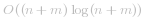

#### 方法一 : 合并后排序

**直觉**

最朴素的解法就是将两个数组合并之后再排序。该算法只需要一行(Java是2行)，时间复杂度较差，为 。这是由于这种方法没有利用两个数组本身已经有序这一点。

**实现**

```Java [solution 1]
class Solution {
  public void merge(int[] nums1, int m, int[] nums2, int n) {
    System.arraycopy(nums2, 0, nums1, m, n);
    Arrays.sort(nums1);
  }
}
```

```Python [solution 1]
class Solution(object):
    def merge(self, nums1, m, nums2, n):
        """
        :type nums1: List[int]
        :type m: int
        :type nums2: List[int]
        :type n: int
        :rtype: void Do not return anything, modify nums1 in-place instead.
        """
        nums1[:] = sorted(nums1[:m] + nums2)
```

**复杂度分析**

* 时间复杂度 :  。 
* 空间复杂度 : *O(1)*。
<br />
<br />

---
#### 方法二 : 双指针 / 从前往后

**直觉**

一般而言，对于有序数组可以通过 _双指针法_ 达到*O(n + m)*的时间复杂度。

最直接的算法实现是将指针`p1` 置为 `nums1`的开头， `p2`为 `nums2`的开头，在每一步将最小值放入输出数组中。

由于 `nums1` 是用于输出的数组，需要将`nums1`中的前`m`个元素放在其他地方，也就需要 *O(m)* 的空间复杂度。


**实现**

```Java [solution 2]
class Solution {
  public void merge(int[] nums1, int m, int[] nums2, int n) {
    // Make a copy of nums1.
    int [] nums1_copy = new int[m];
    System.arraycopy(nums1, 0, nums1_copy, 0, m);

    // Two get pointers for nums1_copy and nums2.
    int p1 = 0;
    int p2 = 0;

    // Set pointer for nums1
    int p = 0;

    // Compare elements from nums1_copy and nums2
    // and add the smallest one into nums1.
    while ((p1 < m) && (p2 < n))
      nums1[p++] = (nums1_copy[p1] < nums2[p2]) ? nums1_copy[p1++] : nums2[p2++];

    // if there are still elements to add
    if (p1 < m)
      System.arraycopy(nums1_copy, p1, nums1, p1 + p2, m + n - p1 - p2);
    if (p2 < n)
      System.arraycopy(nums2, p2, nums1, p1 + p2, m + n - p1 - p2);
  }
}
```

```Python [solution 2]
class Solution(object):
    def merge(self, nums1, m, nums2, n):
        """
        :type nums1: List[int]
        :type m: int
        :type nums2: List[int]
        :type n: int
        :rtype: void Do not return anything, modify nums1 in-place instead.
        """
        # Make a copy of nums1.
        nums1_copy = nums1[:m] 
        nums1[:] = []

        # Two get pointers for nums1_copy and nums2.
        p1 = 0 
        p2 = 0
        
        # Compare elements from nums1_copy and nums2
        # and add the smallest one into nums1.
        while p1 < m and p2 < n: 
            if nums1_copy[p1] < nums2[p2]: 
                nums1.append(nums1_copy[p1])
                p1 += 1
            else:
                nums1.append(nums2[p2])
                p2 += 1

        # if there are still elements to add
        if p1 < m: 
            nums1[p1 + p2:] = nums1_copy[p1:]
        if p2 < n:
            nums1[p1 + p2:] = nums2[p2:]
```

**复杂度分析**

* 时间复杂度 : *O(n + m)*。
* 空间复杂度 : *O(m)*。
<br />
<br />

---
#### 方法三 : 双指针 / 从后往前

**直觉**

方法二已经取得了最优的时间复杂度*O(n + m)*，但需要使用额外空间。这是由于在从头改变`nums1`的值时，需要把`nums1`中的元素存放在其他位置。

> 如果我们从结尾开始改写 `nums1` 的值又会如何呢？这里没有信息，因此不需要额外空间。

这里的指针 `p` 用于追踪添加元素的位置。


       

**实现**


```Java [solution 3]
class Solution {
  public void merge(int[] nums1, int m, int[] nums2, int n) {
    // two get pointers for nums1 and nums2
    int p1 = m - 1;
    int p2 = n - 1;
    // set pointer for nums1
    int p = m + n - 1;

    // while there are still elements to compare
    while ((p1 >= 0) && (p2 >= 0))
      // compare two elements from nums1 and nums2 
      // and add the largest one in nums1 
      nums1[p--] = (nums1[p1] < nums2[p2]) ? nums2[p2--] : nums1[p1--];

    // add missing elements from nums2
    System.arraycopy(nums2, 0, nums1, 0, p2 + 1);
  }
}
```

```Python [solution 3]
class Solution(object):
    def merge(self, nums1, m, nums2, n):
        """
        :type nums1: List[int]
        :type m: int
        :type nums2: List[int]
        :type n: int
        :rtype: void Do not return anything, modify nums1 in-place instead.
        """
        # two get pointers for nums1 and nums2
        p1 = m - 1
        p2 = n - 1
        # set pointer for nums1
        p = m + n - 1
        
        # while there are still elements to compare
        while p1 >= 0 and p2 >= 0:
            if nums1[p1] < nums2[p2]:
                nums1[p] = nums2[p2]
                p2 -= 1
            else:
                nums1[p] =  nums1[p1]
                p1 -= 1
            p -= 1
        
        # add missing elements from nums2
        nums1[:p2 + 1] = nums2[:p2 + 1]
```


**复杂度分析**

* 时间复杂度 : *O(n + m)*。
* 空间复杂度 : *O(1)*。